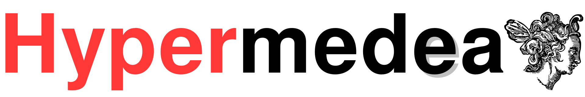

# Hypermedea

Medea is known in Greek mythology as Jason's wife.
Hypermedea is a companion framework to Jason, CArtAgO and Moise (known collectively as [JaCaMo](jacamo.sourceforge.net/)).
Hypermedea is designed for programming hypermedia multi-agent systems.

## Getting started

To get started, download the latest Hypermedea [release](https://github.com/Hypermedea/hypermedea/releases) or generate it from sources.

To generate a release from source, run `gradle install` in the root directory. The shell script to run Hypermedea is then created under `build/install/hypermedea/bin/`.

To run example agents, go to the corresponding folder under `examples`.

## Documentation

Artifacts:
- `LinkedDataFuSpider`: read/write Linked Data browser
- `ThingArtifact`: wrapper for WoT 'things'
- `PlannerArtifact`: PDDL planner (to handle WoT affordances, among others)

Refer to [doc/ldfu-spider-ont/readme.md](doc/ldfu-spider-ont/readme.md) for a documentation of the `LinkedDataFuSpider` artifact.
